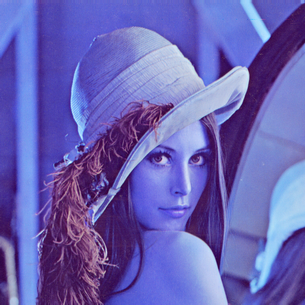
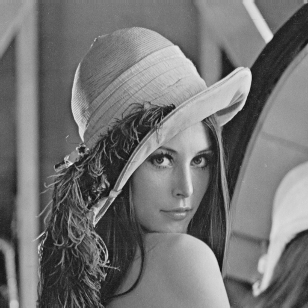
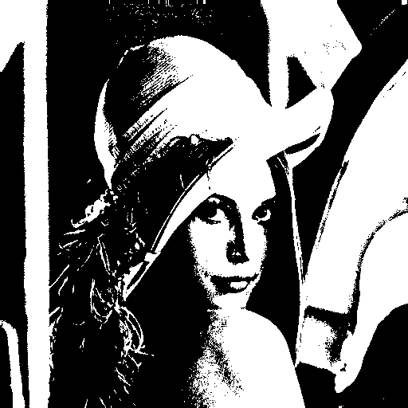
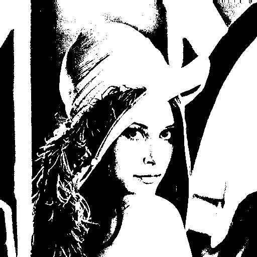
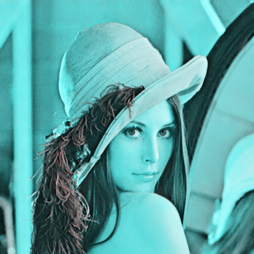
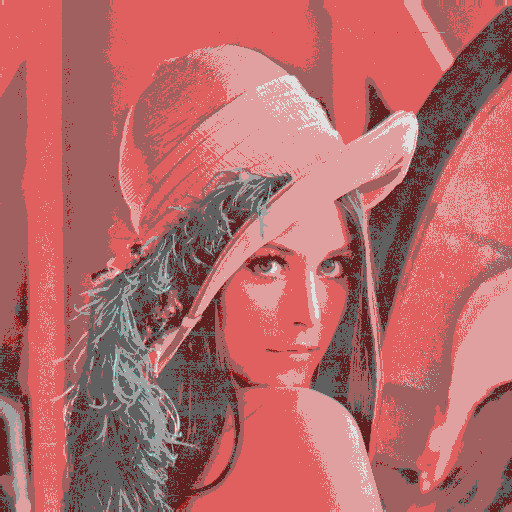

# Chapter1

## Section1:Swap channels
Load an image and switch channels from RGB to BGR.  

※The following is an example using cv2.COLOR_BGR2RGB  
```python
im_rgb = cv2.cvtColor(im_cv, cv2.COLOR_BGR2RGB)
```

|Input|Output|
|:---:|:---:|
|||

## Section2:Grayscale
Convert a color image to a grayscale image.  

※The following is an example using cv2.COLOR_BGR2GRAY  
```python
img_gry = cv2.cvtColor(im_cv, cv2.COLOR_BGR2GRAY)
```

|Input|Output|
|:---:|:---:|
|||

## Section3:Binarization
Binarize color images (convert to black and white).  

※The following is an example using cv2.THRESH_BINARY  
```python
img_thresh = cv2.threshold(im_cv, 128, 255, cv2.THRESH_BINARY)
```

|Input|Output|
|:---:|:---:|
|||

## Section4:Otsu binarization

Adaptive binarization processing.  
https://opencv-python-tutroals.readthedocs.io/en/latest/py_tutorials/py_imgproc/py_thresholding/py_thresholding.html#otsus-binarization

※The following is an example using cv2.THRESH_OTSU  
```python
img_thresh = cv2.threshold(im_cv, 0, 255, cv2.THRESH_BINARY+cv2.THRESH_OTSU)
```

|Input|Output|
|:---:|:---:|
|||

## Section5:HSV conversion

Convert a Color image (RGB) to an image in HSV color space.

※The following is an example using cv2.COLOR_BGR2HSV  
```python
hsv = cv2.cvtColor(im_cv, cv2.COLOR_BGR2HSV)
```

|Input|Output|
|:---:|:---:|
|||

## Section6:Color reduction processing

Color reduction processing for Color images. This is quantization.

※Each value is defined as follows.
```python
val = {  32  (  0 <= val <  64)
         96  ( 64 <= val < 128)
        160  (128 <= val < 192)
        224  (192 <= val < 256)
```

|Input|Output|
|:---:|:---:|
|||


